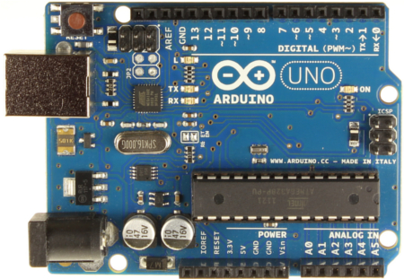

About the Exosite Arduino Library
=================================
This library allows you to quickly and easily connect your [Arduino](http://arduino.cc) project to Exosite's Data Platform in the cloud. It connects your project using an Arduino Ethernet shield, Arduino WiFi Shield, or any other networking shield that subclasses the Client class. See the examples folder for both an Ethernet and a WiFi example.

Note: A free account on exosite portals is required: https://portals.exosite.com

License is BSD, Copyright 2013, Exosite LLC (see LICENSE file)

Tested with Arduino 1.0.5 and 1.5.5



Help
====
Troubleshooting information and help can be in the Exosite Community Forum.

[Community Forum](https://community.exosite.com/)


Requirements
============

* Arduino IDE must be installed on your computer [Arduino IDE](http://www.arduino.cc/en/Main/software)
* Need an internet enabled Arduino system, which is typically done by adding a Ethernet or WiFi.
* Note: Cellular shields typically will not work with this library as is.  They typically require direct AT commands sent to open sockets, send date, etc. The libraries code can be used as reference for what needs to be sent over the modem connection.


Installing
==========
Arduino IDE v1.6.2 or greater
-----------------------------

Newer versions of the Arduino IDE include a Library Manager GUI that you can use to easily install the Exosite library. Simply open the Library Manager:
 
 Next, search for and install the Exosite library:

When updates are pushed to this repository, return to this interface if you would like to update the Exosite library to the newer version.

Earlier versions of the Arduino IDE
-----------------------------------

The easiest way to install this library is to simply clone this repo straight to your libraries folder.

```
cd ~/sketchbook/libraries
git clone https://github.com/exosite-garage/arduino_exosite_library.git Exosite
```

If you would rather not use the command line or you don't have git installed, click the download button on the right hand side of this page and choose to open the ZIP. Copy the contained folder to your Arduino IDE's libraries folder (inside your sketchbook folder) and Rename it to "Exosite". If you do not know the location of sketchbook folder click on "File->Preferences" in the IDE and you should see it listed.

Note: You will need to restart the Arduino IDE after installing the library.

Examples
========
This library includes examples, which will be available in the Arduino IDE 'Examples' menu directory.


Interface
=========

Constructor
-----------
```cpp
Exosite(Client *_client);
```

```cpp
Exosite(char *_cik, Client *_client);
```

```cpp
Exosite(String _cik, Client *_client);
```

`_cik`: This is used to hard code the CIK into the device can either be a `char[]` or a `String` type. This parameter can be omitted when using provisioning.

`_client`: This is the interface to what ever network device you're using. Must be a subclass of [`Client`](http://arduino.cc/en/Reference/ClientConstructor) such as: [`EthernetClient`](http://arduino.cc/en/Reference/EthernetClient), [`WiFiClient`](http://arduino.cc/en/Reference/WiFiClient), or [`YunClient`](http://arduino.cc/en/Reference/YunClientConstructor).

writeRead
---------

```cpp
boolean Exosite::writeRead(char* writeString, char* readString, char** returnString)
```

```cpp
boolean Exosite::writeRead(String writeString, String readString, String &returnString)
```

`writeString`: This sets the values to write to certain datasources. eg. "alias3=value3&alias4=value4"

`readString`: This selects which datasources to read by their alias. eg. "alias1&alias2"

`returnstring`: This is the string returned with the values requested in `readString`. eg. "alias1=value1&alias2=value2"

provision
---------
```cpp
boolean Exosite::provision(char* vendorString, char* modelString, char* snString);
```

`vendorString`: The string that identifies the device vendor name.

`modelString`: The string that identifies the device unique model ID.

`snString`: The string that identifies the device's serial number.


Migration from V1
=================
Version 2 no longer sets up the ethernet shield for you. In your code you'll need to replace `Exosite exosite(&Ethernet, macData, cikData);` with 

```
class EthernetClient client;
Exosite exosite(cikData, &client);
```
You will also need to remove `exosite.init();` and add `Ethernet.begin(macData);` to your setup() function.

Release Info
============
**v2.3.4 - Release 2015-08-10**
 - Fixed time() function, actually returns time now.
 - Added example to use time().
 - Added library.properties for new IDE versions.

**v2.3.3 - Release 2015-04-20**
 - Pushed missing commits from previous release.
 - Put memory debugging stuff behind special ifdef.

**v2.3.2 - Release 2015-03-05**
 - Added client->stop() before client->connect() to activate and timestamp too.
 - Clarified some serial debug statements.
 - Check that CIK is 40 hex characters on seemingly successful activation before blowing away old CIK.

**v2.3.1 - Release 2014-09-17**
 - Added client->stop() before client->connect(), the Ethernet shield seems to need this or connect() does nothing.

**v2.3.0 - Release 2014-09-11**
 - Added EEPROM includes back to all examples.
 - Now leaving socket open between requests.
 - Merged PR from DrewJaworskiRIS to wrap char string in String object constructor before returning. (Thanks!)

**v2.2.1 - Release 2014-08-04**
 - Added needed include statements to Yun examples.

**v2.2 - Release 2014-07-22**
 - Added Provisioning Support
   - Added Internal Functions to Read and Write CIK from EEPROM

**v2.1.1 - Release 2013-11-04**
 - Removed depreciated 'readWrite' method to reduce confusion. 'readFromCloud' and 'sendToCloud' still supported.

**v2.1 - Release 2013-11-01**
 - Changed 'readWrite' to 'writeRead' to reflect parameter order and platform operation order.
 - Added User-Agent String
 - Added client->flush() just before sending HTTP packet, just in case we received something

**v2.0 - Release 2013-10-18**
 - Simplified interface to use character strings or Arduino Strings instead of arrays of character arrays. User must now URL encode and decode their own data.
 - Made compatible with Arduino WiFi shield (and anything that similarly subclasses the Client class).
 - Updated examples to use new interface.

**v1.1 - Release 2013-07-29**
 - Major rewrite to both read and write multiple datasources in one HTTP call.
 - Removed all use of Strings due to stability issues (except for manipulating string object passed to existing functions).
 - Existing `sendToCloud()` and `readFromCloud()` changed to use new call internally. External Interface Unchanged

**v1.0 - Release 2011-06-05**
 - initial version
